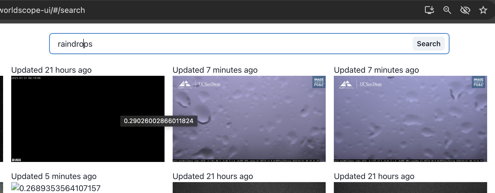

# 🌍 Worldscope Server

## 🔍 Semantic Search on Live Images

The Worldscope Server is a scalable backend application designed for semantic search on a large live dataset of images. It uses the CLIP model to generate embeddings for images and text, enabling efficient and accurate search capabilities.

The primary bottleneck is the creation of embeddings for images, which is managed through queues. The workers can be scaled up or down based on the load.

[🌐 UI](https://shrnik.github.io/worldscope-ui/#/search)

We have a dataset of around 5k live image URLs.

Embeddings are stored in a Postgres database.

We use BullJs for queue management.

### 📌 Endpoints

- 🖼️ POST `/api/v1/images` - Enqueue all images for processing.
- 🔎 GET `api/v1/images?query=storms` - Search for images based on a query
