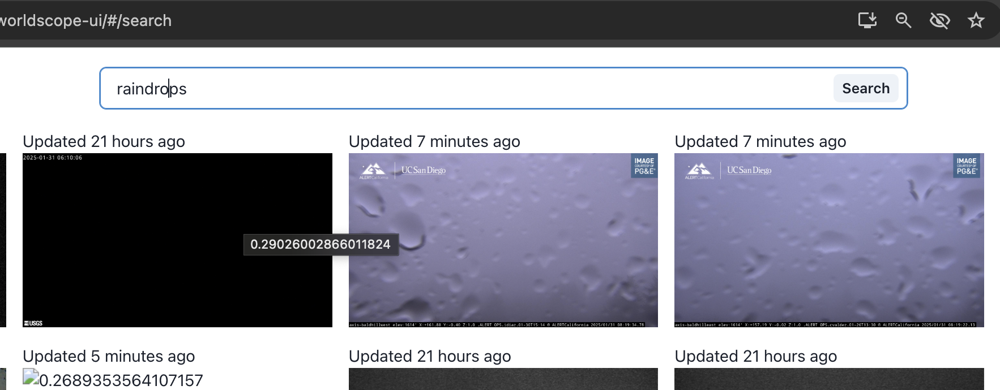

# 🌍 Worldscope Server

## 🔍 Semantic search over live camera snapshots

Worldscope indexes thousands of live public camera feeds and lets you search them by
natural language ("snowy mountains", "airport runway at night") using
[CLIP](https://huggingface.co/openai/clip-vit-base-patch16). Image and text share one
embedding space, so a text query ranks the snapshots by visual similarity.

[🌐 Search UI (Hugging Face Space)](https://huggingface.co/spaces/shrnik/worldscope-search)



## 🏗️ Architecture

Embeddings are computed on demand by **Hugging Face Jobs** (GPU), stored in a public
**HF Storage Bucket**, and searched **in memory** by a small **FastAPI** app — no Redis,
no workers, no database.

```
                        Hugging Face Jobs (on demand)
  download (CPU) ─────────────► embed (GPU) ─────────────► cleanup (CPU)
  cameras + snapshots           CLIP embeddings            prune unreferenced
  → bucket + manifest.parquet   → embeddings.parquet       images in the bucket
                                          │
                                          ▼
              FastAPI server / Gradio Space loads embeddings.parquet
              into memory and serves brute-force cosine search
```

- **Data sources:** a Google Sheet of camera URLs + the FAA weather-camera API (~7–8k cameras).
- **Storage:** `hf://buckets/<ns>/worldscope` holds the snapshots (served via public
  `…/resolve/…` URLs), plus `manifest.parquet` and `embeddings.parquet`.
- **Search:** ~10k × 512-dim vectors (~20 MB) → in-memory numpy cosine search, sub-millisecond.

## 📂 Layout

| Path | Purpose |
|------|---------|
| `app/main.py` | FastAPI app: search, text embedding, deduplicated `/refresh`, image redirect |
| `app/clip_model.py` | Loads CLIP once; `embed_text()` for queries |
| `app/index.py` | In-memory embeddings index + brute-force cosine search |
| `app/hf_jobs.py` | Trigger/poll HF Jobs; build bucket URLs |
| `app/cameras.py` | Camera list (Google Sheet + FAA) |
| `jobs/download_job.py` | HF Job (CPU): fetch cameras + snapshots → bucket + manifest |
| `jobs/embed_job.py` | HF Job (GPU): manifest + images → `embeddings.parquet` |
| `jobs/cleanup_job.py` | HF Job (CPU): delete images not referenced by `embeddings.parquet` |
| `scripts/*.py` | One entrypoint per pipeline stage (used by CI) |
| `.github/workflows/refresh-embeddings.yml` | Sequential `download → embed → cleanup` pipeline |
| `space/` | Gradio search frontend (deployed as a HF Space) |

## 🌐 API

- `GET /images?query=storms` — semantic search; returns top matches with image URLs + scores.
- `POST /embeddings/text` — `{ "text": ... }` → CLIP text embedding.
- `POST /refresh` — start the `download → embed → reload` pipeline (deduplicated: returns
  `409` if one is already running). `GET /refresh` reports status.
- `GET /image/{path}` — redirect to the snapshot's public bucket URL.

## 🔄 Refreshing embeddings

Run the pipeline on Hugging Face infrastructure in either of two ways:

- **GitHub Actions** — *Actions → "Refresh embeddings" → Run workflow*. Three sequential
  jobs (`download → embed → cleanup`); each submits an HF Job with the right hardware and
  the next only runs if the previous succeeded.
- **API** — `POST /refresh` on a running server (chains the same stages, dedup-guarded).

## ⚙️ Setup

```bash
uv sync                       # install deps
cp .env.example .env          # fill in HF_TOKEN, HF_BUCKET, FAA_API_KEY
uv run uvicorn app.main:app   # run the server
```

Key env vars (see `.env.example`): `HF_TOKEN`, `HF_BUCKET` (`<ns>/worldscope`),
`FAA_API_KEY`, `CLIP_MODEL`, and the job flavors `HF_DOWNLOAD_FLAVOR` / `HF_EMBED_FLAVOR`.

> **Note:** HF Jobs require a Pro/Team/Enterprise account with pre-paid credits. For
> GitHub Actions, set `HF_TOKEN` (and optionally `FAA_API_KEY`) as repository secrets.
